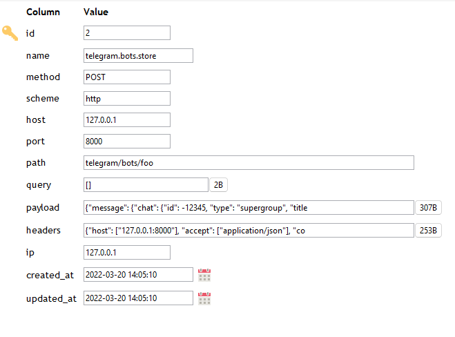

# Laravel HTTP Logger


[![Stable Version][badge_stable]][link_packagist]
[![Unstable Version][badge_unstable]][link_packagist]
[![Total Downloads][badge_downloads]][link_packagist]
[![Github Workflow Status][badge_build]][link_build]
[![License][badge_license]][link_license]


## Installation

To get the latest version of `Laravel HTTP Logger`, simply require the project using [Composer](https://getcomposer.org):

```bash
composer require dragon-code/laravel-http-logger
```

Or manually update `require` block of `composer.json` and run `composer update`.

```json
{
    "require": {
        "dragon-code/laravel-http-logger": "^1.0"
    }
}
```

## Usage

Run the migrations and submit a request to the site.

By default, the plugin is ready to go.

If you need to change the database connection or table name, you can do it in the [settings](config/http-logger.php).

### Database table

All incoming HTTP requests will be logged to a database table. The default name is `http_logs`.

For example:



## License

This package is licensed under the [MIT License](LICENSE).


[badge_build]:          https://img.shields.io/github/actions/workflow/status/TheDragonCode/laravel-http-logger/laravel-9.yml?style=flat-square

[badge_downloads]:      https://img.shields.io/packagist/dt/dragon-code/laravel-http-logger.svg?style=flat-square

[badge_license]:        https://img.shields.io/packagist/l/dragon-code/laravel-http-logger.svg?style=flat-square

[badge_stable]:         https://img.shields.io/github/v/release/TheDragonCode/laravel-http-logger?label=stable&style=flat-square

[badge_unstable]:       https://img.shields.io/badge/unstable-dev--main-orange?style=flat-square

[link_build]:           https://github.com/TheDragonCode/laravel-http-logger/actions

[link_license]:         LICENSE

[link_packagist]:       https://packagist.org/packages/dragon-code/laravel-http-logger
